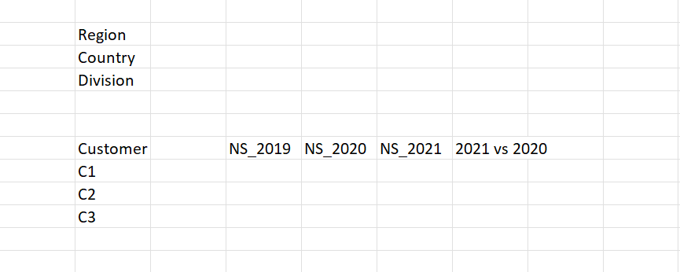
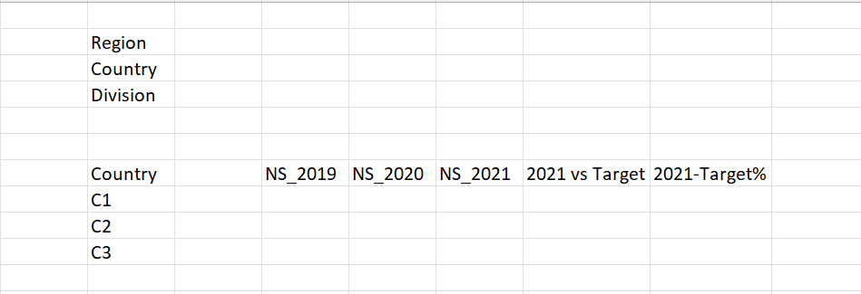
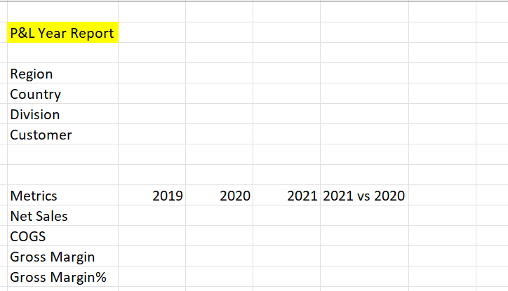
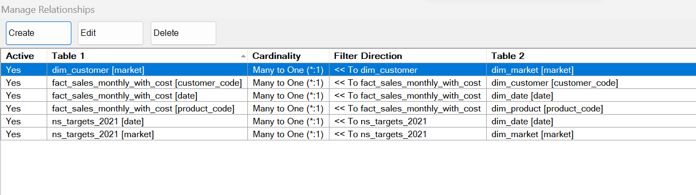
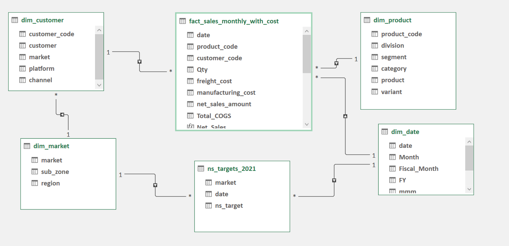

# Atliq-Hardware-Report-Excel

## Introduction
Atliq Hardware is a company that sells computer hardware products to big retailers like CROMA, Flipkart, Staples, and Bestbuy, who then sell them to individual consumers.  
They make these products in their own factory, store them in a warehouse, and have distribution centers to send them out when they get orders.  

The problem is, Atliq relies too much on Excel files to keep track of everything, and they want to find a better way to manage their data.  
But they can't completely get rid of Excel because it's essential for analyzing data.  

So, what we're going to do is use the information provided by the business team at Atliq to create reports about their sales and financial data.  
These reports will help them make better decisions without relying too heavily on Excel.  
Managing a massive amount of sales data, totaling over 500,000 records.  

## Mock-Up  
Build Mock up’s for the following reports:  
1.	#### Customer Performance Report ####    
  	   
  	
2.	#### Market VS Target Performance report ####
  	
  	
3.	#### P&L by Fiscal Year ####
  	
  	
4.	#### P&L by Fiscal Months ####  
      
        

## Skills/Concepts Demonstrated ##    
1.	The _ETL_ process involves importing data from a CSV file into Excel and then using Power Query for various transformations. The transformed data is then loaded back into Excel, but this is done on different sheets.  
2.	_Data Cleaning_ is a crucial step where we follow a checklist to ensure the data is appropriately cleaned for further analysis.Ensure there are no missing values.  
      - Ensure that all the dimension tables contain unique values.
      - Ensure there are no errors or #NA in columns.
      - Randomly check spellings.  
3.	In _Data Modeling_, we have Fact and Dimension tables. The images below show the relationships and the data model in Power Pivot.
   
Relationship                  |     Data-model
:---------------------------: | :-------------------------:
 |    

5.	When _designing reports_, it's important to focus on user readability. This can be achieved by improving the number format and using conditional formatting to enhance the speed of understanding.  
   We can also improve the reports through text formatting and color formatting.  

## Functions/Formula used
1.	_=RELATED()_  function in power pivot is used to establish a relationship between tables and retrieve related data from one table to another in a data model.  
2.	_= {Number.From(#date(2018,1,1))..Number.From(#date(2018,12,31))}_
    M- formula to get the date table, in Power Query.  
3.	_=Date.AddMonth()_
    used to get the fiscal month in power query editor.  
4.	_=Date.year()_, to get the Fiscal Year
5.	Created few DAX measures:  
   - _= CALCULATE()_ to get the net sales for a specific year
   - _= SUM()_ to get the sum of the net sales amount
   - _= DIVIDE()_ to compare the net sales amount between two years
6. _=IFERROR()_, used to do avoid the ‘#DIV’ and replace them with a blank space.
7. _=FORMAT()_,in power pivot, to the fiscal month in ‘MMM’
8. _=MONTH()_, in power pivot, to get the calendar month  
     _=MONTH(DATE(YEAR([date]),MONTH([date])+4,1)_,used to get the Fiscal month number  
     _=”Q” & ROUNDUP([fiscal_month_no]/3,0)_ ,used to get the fiscal quarter

## Tables Created  
### Dim_date table ###  
Before creating dim_date table we have to do some operations to convert from dd/mm/yyyy to mm/dd/yyyy  
Since, my Date column in fact_sales_monthly table was in dd/mm/yyyy format.The below steps were used to convert to mm/dd/yyy.To convert a date type from "dd/mm/yyyy" to "mm/dd/yyyy" in Power Query Editor, you can follow these steps: 

  •	Open your Power Query Editor.  
  •	Load the data that contains the date column you want to convert.  
  •	Select the date column you want to transform.  
  •	In the "Transform" tab, you can split the date column into day, month, and year using the "Split Column" feature.  
    You can choose to split by delimiter (using the "-" or the character you used in step 4 as the delimiter).  
  •	Once you have separate columns for day, month, and year, you can use the "Combine Columns" feature to create a new column in the desired "mm/dd/yyyy" format.  
    Name the 3 different columns as Date,Month,Year.  
    
#### Combine Columns: ####  

In Power Query Editor, you'll need to use the "Custom Column" function to combine the day, month, and year columns. Here's how:  

  I.Select the day, month, and year columns.  
  II.Go to the "Add Column" tab.  
  III.Click on "Custom Column."  
  IV.Create a Custom Column:In the "Custom Column" dialog box, you can create a custom formula to combine the columns.  
      Assuming your day column is named "Day," your month column is named "Month," and your year column is named "Year," you can use a formula like this:  
      _= Text.From([Month]) & "/" & Text.From([Day]) & "/" & Text.From([Year])_ .This formula concatenates the values from the "Month," "Day," and "Year" columns with "/" separators to create a date in "mm/dd/yyyy" format.  
  V.	Change Data Type:After creating the custom column, it will be treated as text. To change the data type to a date/time.  
        
•	Finally, you can rename or replace the original date column with the newly created "mm/dd/yyyy" column, and then load the data back into your workbook.  
  
### Steps to create dim_date table: ###  

1.	Power Query Editor -> Right click -> New Query-> Other Sources -> Blank Query.And name it as dim_date  
2.	From Google will get the M- formula to create date table:  
    _= {Number.From(#date(2018,1,1))..Number.From(#date(2018,12,31))}_  
Here , we need to get the first and end date from fact table.In,fact table to get the end date,sort the date column by DESC order.  
Use those 2 dates in the above M-formula: _={Number.From(#date(2018,9,1))..Number.From(#date(2021,8,1))}_  
4.	Right click->List to Table -> Ok  
5.	Rename the column name to date and change the data type to Date.  
6.	Add the column ‘Start of month’  name it as ‘Month’and ‘Year’ convert the data type from Number to Text[as there is no need of aggregate function to be done with Year values]  
7.	Get the Fiscal_Year_month using formula : _=Date.AddMonths([Month],4)_    
To get the Fiscal_Year: _=date.year([Fiscal_Year_Month])_  

Close and Load and under Queries & connections, Right click dim_date->Load to->Only create connection and check ‘Add data to data model’  
Power pivot ->Manage->Diagram View->connect fact_sales_monthly table with dim_date table [using Date column].  

## Analysis:  
 ### 1. [Customer Performance Report](https://github.com/Rose1019/Atliq-Hardware-Report---Excel/blob/main/CUSTOMER_PERFORMANCE_REPORT.pdf) ###  
    
The provided data on customer-wise net sales for 2019, 2020, and 2021, along with the percentage change from 2020 to 2021.  

#### Amazon Dominance ####  
Amazon stands out as the customer with the highest net sales in 2021, reaching $82.1 million. This indicates that Amazon is a significant contributor to the company's overall revenue.  
#### Top Performers in 2021: ####
In addition to Amazon, "AtliQ Exclusive" and "AtliQ E-Store" have also demonstrated substantial growth in net sales in 2021. These customers are among the top performers in terms of revenue contribution.  
#### Exceptional Growth for Nova: ####  
The customer "Nova" has experienced exceptional growth, with net sales increasing by an astonishing 2664% from 2020 to 2021. This remarkable growth could be due to various factors such as new product launches, market expansion, or promotional campaigns.  
#### Integration Stores: ####   
"Integration Stores" has also shown significant growth, with a 887% increase in net sales from 2020 to 2021. Understanding the specific reasons behind this growth, such as strategic partnerships or product innovations, could be beneficial for future planning.  
#### Overall Growth: ####     
The grand total of net sales has increased by an impressive 304.5% from 2020 to 2021, indicating robust overall company growth during this period.  

In summary, this analysis provides an overview of customer-wise net sales growth and identifies notable performers such as Amazon, AtliQ Exclusive, and AtliQ E-Store.  
It also highlights customers like Nova and Integration Stores that have experienced exceptional growth.  
Understanding the reasons behind these trends and tailoring strategies accordingly can be crucial for sustained success.  

### 2. [Market performance VS Target](https://github.com/Rose1019/Atliq-Hardware-Report---Excel/blob/main/MARKET_PERFORMANCE_VS_TARGETS_REPORT.pdf) ###   
The provided data shows the net sales performance for various countries in 2019, 2020, and 2021, along with the difference between the 2021 actual net sales and the target net sales, expressed both in absolute terms and as a percentage.  

#### Overall Performance: ####  
The grand total of net sales for the company decreased from $598.9 million in 2020 to $544 million in 2021, resulting in a decline of $54.9 million or 8.4%.  
This indicates that the company as a whole did not meet its net sales target for 2021.  

#### Underperforming Countries: ####   
Several countries did not achieve their 2021 net sales targets. Notable examples include:  
    _USA_: Missed the target by $10.2 million, representing a -10.4% deviation.  
    _India_: Missed the target by $9.6 million, representing a -5.6% deviation.  
    _Poland_: Missed the target by $0.9 million, but when expressed as a percentage, it's the most significant deviation at -15.3%.  
    
#### Impact of Targets in Absolute and Percentage Terms: ####  
While the USA and India missed their targets by significant absolute amounts, when considering the percentage deviation, Poland stands out as the country with the most substantial relative underperformance.   
This highlights the importance of considering both absolute and percentage deviations to assess performance accurately.   

In conclusion, the analysis of country-wise net sales performance against targets reveals both absolute and percentage deviations,highlighting underperforming countries such as the USA, India, and Poland.This information can guide strategic decisions and adjustments to improve overall performance in the future.  

### 3. [P&L by Fiscal Years](https://github.com/Rose1019/Atliq-Hardware-Report---Excel/blob/main/P_%26_L_BY_YEARLY_REPORT.pdf) ###   

#### Net Sales Growth: ####  
Net sales have shown significant growth over the three years, increasing from $87.5 million in 2019 to $598.9 million in 2021.  
This represents a remarkable 204.5% increase from 2020 to 2021. The substantial growth in net sales indicates that the company's revenue has been on a strong upward trajectory.  

#### Cost of Goods Sold (COGS): ####  
The cost of goods sold has also increased over the years, which is expected when net sales are increasing.  
In 2021, COGS reached $380.7 million, a 208.6% increase compared to the previous year. This indicates that the company has been selling more products but also incurring higher costs associated with those sales.  

#### Gross Margin: ####  
Despite the increase in COGS, the gross margin has grown from $36.2 million in 2019 to $218.2 million in 2021.  
However, the gross margin growth rate is slightly lower than the growth in net sales and COGS, indicating potential pressure on profitability.  

#### Gross Margin Percentage: ####  
The gross margin percentage, which measures the profitability of each sale, has seen a decrease over the years. It dropped from 41.4% in 2019 to 36.4% in 2021.   
This suggests that the company may be facing challenges in maintaining its profit margins as it scales up its operations. The decrease of 2.3% in gross margin percentage from 2019 to 2021 is a concern and requires further analysis.

